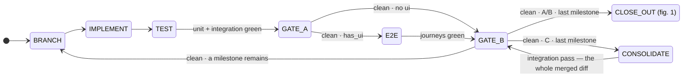

# SDLC Graph

> **The milestone loop runs in a milestone agent** — one per milestone, one per worktree under
> strategy C — whose returned bundle the orchestrator verifies against git before recording
> anything.
>
> **Run state changed shape in 1.0.0, and there is no migration.** A run is one gitignored
> directory, `docs/graph-runs/<run-id>/`, holding `state.json`, a `journals/` per milestone agent,
> and — with `--trace` — a numbered `history/`. Up to 0.11.1 it was the flat, committed
> `docs/sdlc/<run-id>-state.json` at `schema_version 2`. **A 0.11.1 run cannot be resumed by 1.0.0**:
> the version check is an unconditional halt, by design, because a half-understood state file drives
> a graph into transitions nobody wrote. Finish in-flight runs before upgrading, or start them again.
>
> **The repo's PostToolUse eval hook watches this plugin**, and runs the viewer's suite alongside it
> — a guard edited here is what makes the viewer's copy of the transition table stale. The whole
> deterministic set costs 3.6s.

Runs the full software lifecycle as an **explicit guarded graph** instead of a chain of prose:
20 nodes, 40 guarded transitions, ten bounded cycles, and a typed run-state file that survives context
loss.

## Why

The author's standalone process skills already *were* the nodes. What lived only in sentences were the
**edges** — and five things can't be expressed that way:

| Gap | Consequence |
|---|---|
| No run state | Nothing records which milestone is in flight or what was skipped. A context loss restarts from guesswork. |
| Unevaluated guards | "e2e (UI only)", "re-run only if findings are significant", "reopen for S1/S2" are conditions nothing checks. |
| Unbounded loop-backs | Eight real cycles exist. In prose, none declares a limit — an agent will re-run a failing gate until something else stops it. |
| No skipped-gate record | Two skills say *never report a gate as passed when its tool was absent* — but nothing records the absence, so the rule is unenforceable. |
| Not resumable | The skills are re-entrant; the *sequence* isn't. |

## How it actually works

**One page, [`docs/artifacts/index.html`](docs/artifacts/index.html)** — six views behind a menu at the top: what a run
does, the graph, every node contract, how work is delegated and checked, the files and the state
file, and how the whole thing is tested. *(GitHub shows `.html` as source — open it locally, or
follow the link.)*

| | | |
|---|---|---|
| 📗 **[The whole thing](docs/artifacts/index.html)** | Run · Graph · Nodes · Delegation · Files & state · Testing | [view](https://claude.ai/code/artifact/045a2e11-cade-45c0-9484-b2edf0db8903) |
| 📡 **Run viewer** | Moved to the **`sdlc-graph-viewer`** plugin — optional companion, triggered at run start when installed | [demo](https://claude.ai/code/artifact/de145d90-62da-4778-a84f-7049ef11f3a6) |

### The one distinction that explains everything

The files in this plugin are **not the same kind of thing**, and that is the distinction everything else follows from:

| | What it is | What happens to it |
|---|---|---|
| **Markdown** | Instructions written for the model | **Read into context** and followed. Nothing "runs" — if the file isn't read, nothing in it happens. |
| **JavaScript** (1 file) | Real code | **Actually executed** by the Workflow tool. Deterministic, regardless of what the model thinks. |
| **Agent** (1 file) | A prompt for a *separate* model instance | **Spawned** with fresh context. Can't see the conversation; returns only its result. It is the **milestone agent**, spawned once per milestone. |
| **`plugin.json`** | Manifest | Read at install. Never during a run. |

That's why `SKILL.md` opens by *ordering* the model to load `nodes.md`, `edges.md` and `state.md` —
a rule is only in force if its file was read. And it's why the fan-out lives in code: a review
pipeline that "usually" runs four steps is not a gate.

### What each file does, and when

```
plugins/sdlc-graph/
├── .claude-plugin/plugin.json        config · install only
├── README.md · docs/artifacts/*.html for humans; never read during a run
│
├── agents/
│   └── sdlc-graph-milestone.md  AGENT  · one per milestone — runs the whole loop
│
└── skills/sdlc-graph/
    ├── SKILL.md                      ENTRY POINT · the only file read when you type the command
    ├── graph/                        THE MODEL — all three read before the first transition
    │   ├── nodes.md                  the 19 node contracts, and the `human:` rows that ARE the stops
    │   ├── edges.md                  30 rows · 40 guarded transitions · consulted at EVERY hop
    │   └── state.md                  the run-state schema, write points, resume, the ledger
    ├── nodes/                        THE PROCEDURES — one per node, read LAZILY
    │   ├── <name>-node.md      ×8    only when that node runs
    │   └── qa/*.md             ×5    read at QA · playbook, taxonomies, report template
    ├── subagents/
    │   └── workflow-dispatch.md      the milestone agent: brief, bundle, journal, return gate
    ├── observability/
    │   └── observability.md          the viewer, and what replaced the auditor this graph dropped
    ├── workflows/
    │   ├── gate-a.workflow.js        EXECUTED at GATE_A — the only code that runs
    │   └── gate-a.harness.mjs        its 81 assertions · part of run_all.py
    └── evals/                        the PostToolUse hook runs run_all.py on every edit here
        ├── run_all.py                every deterministic suite, one verdict
        ├── lib/                      paths.py (the layout, once) · invariants.py (shared)
        ├── spec/                     the spec agrees with itself — and those checks can fail
        ├── walks/                    scripted runs + fixtures/ · coverage is a gate
        ├── audit/                    audits a REAL run, offline, afterwards — and its self-tests
        ├── runs/                     scenarios that EXECUTE — real root, scripted milestone agent
        ├── real/                     both sides real, judged against a real repo
        └── behavioural/              the cases only a model can answer
```

> **Every kind of thing has its own directory, including the ones holding a single file.** The
> alternative was thirteen `.md` files flat in `references/` next to five QA files and two `.js`
> scripts, which is where this started. Entry points — `SKILL.md`, `evals/run_all.py` — stay at the
> top of their directory: burying the thing you run is the opposite of navigable.

### A run, end to end

1. **You invoke it** — `/sdlc-graph <context>`, free text, as much of it as you have. Nothing
   auto-triggers it, and there is no second command to learn.
2. **`SKILL.md` loads**, and immediately loads the three model files.
3. **`INTAKE`** *(inline)* — detects stack, `has_ui`, branch, host; creates the state file.
4. **`SPEC` → stops for you.** Design dialogue, then waits for approval.
5. **`PLAN` → stops for you.** Writes the plan, then waits. *The last cheap moment to change direction.*
6. **`STRATEGY` → stops for you.** Branching A/B/C/D, and whether PRs open automatically.
7. **Then it runs by itself**, per milestone — and **not in the orchestrator's context**: a **milestone
   agent** is spawned per milestone (under C, one per worktree, all in one message) and runs
   `BRANCH → IMPLEMENT → TEST → GATE_A → [E2E] → GATE_B`, returning one typed bundle. The
   orchestrator verifies that bundle against git, a suite it re-runs itself, and the workflow
   journal — **then** writes the transitions. A gate it cannot evidence is re-run, not recorded.
   - **`GATE_A` executes JavaScript** — groups changed files by module, four review steps per group,
     groups concurrent. *1,000 files → 85 groups → 340 agents, every file reviewed.*
   - This loops back to `BRANCH` for the next milestone **without opening a PR** — no strategy opens
     one inside the loop any more.
   - Under **C** each milestone builds in **its own git worktree**, concurrently where `deps` allow.
8. **`CONSOLIDATE`** *(C only)* merges every worktree into one integration branch, in dependency
   order, runs the **integrated** suite, and removes the worktrees. Then a whole-diff `GATE_B` pass.
9. **Then one shared tail, every strategy** — `CLOSE_OUT → PR → PR_FINAL_REVIEW → CI → QA → VERDICT → MERGE`.
   **Nothing reaches `main` until QA has passed**, and the diff a human approves carries its own QA
   verdict, plan updates and regression tests. **`MERGE` waits for you**; it never merges.
10. **`QA`** *(agent)* live-probes the running app — always an unmerged branch.
11. **`DONE`** — reports **what was skipped, first.**

### The four ways a node acts

| | Nodes | What happens |
|---|---|---|
| **inline** | `INTAKE` `CONSOLIDATE` `MERGE` `VERDICT` `DONE` | `SKILL.md` does it directly |
| **node file** | `SPEC` `PLAN` `STRATEGY` `PR` `CI` `CLOSE_OUT` `QA` | Loads `nodes/<name>-node.md` and follows it |
| **milestone agent** | `BRANCH` `IMPLEMENT` `TEST` `GATE_A` `E2E` `GATE_B` `DEBUG` | A subagent per milestone runs them and returns a bundle the orchestrator verifies |
| **live dispatch** | `IMPLEMENT`, Gate A's reviewers | Calls the *currently installed* skill — never a copy |
| **script** | `GATE_A`, strategy C | The Workflow tool executes JavaScript |

### Where it stops for you — six places, and nowhere else

| Stop | Type | What it needs |
|---|---|---|
| `SPEC` | `approval-after` | Approve the design |
| `PLAN` | `approval-after` | Approve the milestones |
| `STRATEGY` | `choice-after` | Branching, and auto-open-MR |
| `PR` | `confirm-before` | Only if you asked it not to open automatically |
| `MERGE` | `await-external` | Not a question — it waits for the merge |
| `VERDICT` | `escalation` | Only on the 2nd exhausted QA reopen |

Every other node runs start to finish without asking. That list is **derived from the `human` field
on each node contract**, so it cannot drift from the contracts.


## The flow

Two figures rather than one. A single diagram of all 40 transitions tangles — twelve of them are `DEBUG`
round-trips and backward loop-backs that cross the middle — so the spine and the loop are drawn
separately, and **cycles are annotated rather than drawn**.

### Figure 1 — the spine

```mermaid
stateDiagram-v2
    direction LR
    [*] --> INTAKE
    INTAKE --> SPEC: no spec supplied
    INTAKE --> PLAN: spec supplied
    SPEC --> PLAN: user approved
    PLAN --> STRATEGY: plan.md on disk
    STRATEGY --> LOOP: strategy A/B/C
    STRATEGY --> [*]: strategy D — hand off
    LOOP --> CLOSE_OUT: A/B — last milestone
    LOOP --> CONSOLIDATE: C — last milestone
    CONSOLIDATE --> CLOSE_OUT: worktrees merged · integrated suite green · GATE_B pass
    CLOSE_OUT --> SHIP: always — the work must still land
    SHIP --> QA: app runnable
    SHIP --> MERGE: nothing runnable — QA skipped, said out loud
    QA --> VERDICT
    VERDICT --> MERGE: PASS, or only S3/S4
    VERDICT --> LOOP: BLOCK or any S1/S2 — reopen on the open branch
    MERGE --> DONE
    DONE --> [*]
    state "MILESTONE LOOP (fig. 2)" as LOOP
    state "PR → PR_FINAL_REVIEW → CI" as SHIP
```



**One tail, every strategy.** From `CLOSE_OUT` the sequence is identical: `PR → PR_FINAL_REVIEW → CI → QA → VERDICT →
MERGE → DONE`. **`MERGE` is always the last node before `DONE`** — a single merge per run, after QA
has passed. Only the *loop* differs, and `CONSOLIDATE` is what lets C's parallel worktrees rejoin it.

### Figure 2 — inside the milestone loop, once per milestone



**`PR`, `CI` and `MERGE` are not in this loop under any strategy** — they run once, afterwards, with
QA between CI and the merge.

**Under C, `BRANCH` also creates a worktree**, so milestones whose `deps` are satisfied build
concurrently without colliding over one index. `GATE_B` therefore runs **twice** under C: once per
milestone on its own diff, and once more after `CONSOLIDATE` on the whole integrated diff — the
cross-*milestone* interactions no single worktree could contain. Under A and B the last milestone's
pass already does both jobs, because everything landed on one branch.

Five nodes can bounce to `DEBUG` and come back — drawn as annotations because the arrows would
obscure the shape:

| Node | Cycle | Bound | On exhaustion |
|---|---|---|---|
| `TEST` | ↺ `DEBUG` | 3 | `BLOCKED` |
| `E2E` | ↺ `DEBUG` | 3 | `BLOCKED` |
| `GATE_A` | ↻ itself | 1 re-run, **real findings only** | **proceeds**, documented |
| `GATE_A` | ↺ `DEBUG` | 2 | `BLOCKED` |
| `GATE_B` | ↺ `DEBUG` | 2 | `BLOCKED` |
| `CI` | ↺ `DEBUG` | 15-min budget + 2-same-error | `STILL-RED` / `BLOCKED` |
| `VERDICT` | → reopen | 2 | `BLOCKED` |

`debug.return_to` is what makes the return deterministic — without it a resumed run could not tell a
test failure from a CI failure.

## What each gate catches that the others can't

They are not redundant; each sees a defect class the others structurally cannot.

| Gate | Scope | Catches |
|---|---|---|
| `TEST` | one milestone's code | Logic. Breadth lives here — every branch, validation rule, edge case. |
| `GATE_A` | **each file in isolation**, four steps per file | File-local defects: bugs, needless complexity, vulnerabilities. Fans out via a workflow script so files review concurrently. |
| `E2E` | the running UI | Whether a user can actually complete a money path. UI projects only — the node **does not exist** without a UI. |
| `GATE_B` | **the whole diff at once** | Cross-file interaction and overall coherence — invisible to a per-file pass, which is why passing Gate A never exempts a change from Gate B. |
| `CI` | the real pipeline | "Passes locally but red in CI" — environment, ordering, and config reality. |
| `QA` | the **deployed, running** app | What the committed suite structurally cannot reach: boot/config reality (in-process tests pass on a broken server), authorization abuse across two accounts, injection, serialization leaks. |

## Branching strategy changes the topology

Not a parameter — a different graph.

**Every strategy runs the milestone loop in a milestone agent.** What changes between them is how many
milestone agents are alive at once, and where they build.

| | Milestone agents | Where milestones are built | How they converge | PR/CI/QA/MERGE |
|---|---|---|---|---|
| **A** one branch, one MR | one at a time | `BRANCH` once, then the milestone agent loop per milestone on that branch | already one branch | **once, at the end** |
| **B** current branch | one at a time | same as A, `BRANCH` is a no-op | already one branch | once, at the end |
| **C** worktree per milestone | **N at once** | **each milestone in its own git worktree**, independent ones running concurrently | `CONSOLIDATE` merges them into one integration branch | once, at the end |
| **D** delegate to `/batch` | none | the graph writes the plan and **stops** at `HANDOFF` — `/batch` is a user command a skill cannot invoke | — | user-run |

**QA gates the merge under every strategy.** The whole close-out — plan updates, `CLAUDE.md` changes,
the QA plan and report, and the regression test written for every confirmed finding — lands *inside*
the reviewed diff, and a `BLOCK` verdict never reaches `main`.

**C is now parallel-first, and that is the only reason to choose it.** The earlier shape bought
independent landing with a PR, a CI run and a merge *per milestone* — eight extra edges, per-milestone
PR churn, and QA that could only ever run against `main` after the fact. Consolidating locally keeps
the parallelism and collapses the tail: one integration branch, one PR, one QA pass, one merge.

## Watching a run live

Install **`sdlc-graph-viewer`**, which ships in the same bundle as this plugin and is optional —
`/plugin install sdlc-graph-viewer@sdlc-graph-engineering`. The graph triggers it at run start:
one server per project on a stable derived port, the page polling the state file every
1s — forever, even after `DONE`. Without the plugin, the run proceeds identically; you just watch
the state file instead of a page.

## Run state and resume

`docs/graph-runs/<run-id>/state.json`, written on **every** transition, before the next node starts — so a
crash between two nodes still leaves a file saying exactly where the run was.

To resume: read the file, then **re-derive the current node's progress from the world** — was the
branch created? are the tests green? has the PR merged? The filesystem, git and the host are the
truth; the state file only says where to look. A run may have died *mid-node*, leaving partial work.
`attempts` is never rewound — rewinding would hand a stuck loop an unlimited budget.

Four terminal states: `RUNNING` · `BLOCKED` (something failed; resumable) · `HANDOFF` (a deliberate
stop, nothing wrong) · `DONE` (**not necessarily clean** — read the skipped-gate ledger first).

## The skipped-gate ledger

Two source skills already said *never report a gate as passed when its tool was absent.* In prose that
rule is unenforceable, because nothing records the absence. Here it is mechanical: preflight resolves
each node's `requires`, a missing tool appends to `skipped_gates[]` with its reason, and **the node
cannot be marked passed.** Close-out copies every entry into the plan; `DONE` leads with them. Entries
are append-only — installing the tool later does not retroactively pass the gate.

## How this is tested

**Two methods, answering different questions.** Full account, with the commands and what each has
actually caught: **[`docs/TESTING.md`](docs/TESTING.md)** — or the illustrated
version, [`docs/artifacts/index.html`](docs/artifacts/index.html) → **Testing**.

- **Deterministic, no agents.** Reads the spec and the fixtures and asks whether they contradict
  each other: spec consistency and its negative controls, scripted walks behind a coverage gate over
  every node and every edge, the offline auditor and its controls, the run-eval self-test, the trace
  hook's controls, and the `GATE_A` harness. **The counts are deliberately not restated here** —
  `evals/run_all.py --list` prints every suite, what it asks, and how much of it there currently is,
  read from the suites themselves. Three prose surfaces used to carry that table and all three
  drifted; this README was the fourth, claiming 44 checks against 75 and 39 of 40 edges against 40 of
  40. The viewer's copy of the transition table has its own runner, in `sdlc-graph-viewer`.
- **Executing, with agents.** A subagent plays the orchestrator and the run is judged on the files it
  leaves. `evals/runs/` pairs it with a scripted milestone agent — which is what lets a scenario contain an
  exact lie, or a milestone agent that dies mid-node. `evals/real/` makes **both sides real** against a real git
  repo, because a scripted milestone agent satisfies the journal contract by construction and so cannot test the
  half of it that is about the milestone agent.

```bash
python3 skills/sdlc-graph/evals/run_all.py                    # deterministic
python3 skills/sdlc-graph/evals/runs/run_scenario.py --self-test    # executing — no agent needed
python3 skills/sdlc-graph/evals/real/run_real_eval.py --list   # executing — real root + real milestone agent
```

**A check that cannot fail is not evidence.** Every negative control is asserted to break the thing it
controls; three checks in this suite were found inert exactly that way.

## Usage

**Command-invoked only** — this skill is never auto-triggered. Running an entire SDLC is not
something to enter on a description match.

```
start <feature>          # new run
resume                   # pick up where it stopped
status                   # report position without advancing
  --spec <path>          # skip the SPEC node
  --plan <path>          # enter at STRATEGY
```

State lives in `docs/graph-runs/<run-id>/state.json`, written on **every** transition — so a crash between
two nodes still leaves a file that says exactly where the run was.

## What it does not do

- **It does not replace the standalone skills.** `plan-guidelines`, `code-quality-pipeline`,
  `qa-engineer` and the rest are **unmodified** and still auto-trigger. Want just a plan? Use
  `plan-guidelines` directly. This graph is a layer *above* them and never a dependency *of* them.
- **It does not merge its own work.** `MERGE` polls until a human or configured auto-merge lands the
  PR, and blocks if it's closed unmerged. Review is the point of opening one.
- **It does not fake a green.** Skipped tests, `continue-on-error`, `|| true`, weakened assertions —
  forbidden. A green earned that way is a failure, not a pass.
- **It does not let a trigger rule pull in its own twin.** If your `CLAUDE.md` mandates loading
  `plan-guidelines` whenever planning starts, that trigger is **suspended while a run is active** —
  the graph's trimmed node copies are authoritative. Loading the standalone `plan-guidelines` mid-run
  would double-drive the milestone loop, since its Phase 2 *is* that loop.
- **It does not silently skip a gate.** A missing reviewer or test runner is recorded in
  `skipped_gates[]`, copied into the plan at close-out, and led with in the final report.

## Skills and agents

| | Invocation |
|---|---|
| `sdlc-graph` (skill) | `sdlc-graph:sdlc-graph` — command only |
| `graph-run-reviewer` (skill) | `sdlc-graph:graph-run-reviewer` — reviews a FINISHED run and writes the evals it should have had |
| `onboarding` (skill) | `sdlc-graph:onboarding` — the tooling checklist: which of the third-party tools in [`docs/DEPENDENCIES.md`](docs/DEPENDENCIES.md) this session can invoke, the install line for each it cannot, and what a run does without each one. **`INTAKE` invokes it on every run.** Advisory: it installs nothing, emits nothing, and can never stop or delay a run |
| `sdlc-graph-milestone` (agent) | never invoked by hand — the orchestrator spawns one per milestone |

**There is no live auditor.** Up to 0.11.1 this plugin spawned a read-only monitor agent alongside every run.
It cost tokens on every run and, in the one event it existed to catch, died at a session rollover
having observed 0 of 28 transitions while nothing noticed. The agent file was kept on disk,
dormant, "so a revival is one commit" — which is what git is for, and it is now deleted too.

What carries that weight now is three things, and it is worth keeping them apart. The state file's
trail is the **verified** record — written only after a bundle passes the return gate. Each milestone agent's
**journal** (`docs/graph-runs/<run-id>/journals/milestone-<id>.jsonl`) is what that milestone agent wrote while it ran, reaching the
orchestrator node by node so it can supervise rather than wait; it is telemetry, nothing routes on it,
and the one check that reads it (R13) uses it to catch a bundle omitting work, never to prove work
happened. And `evals/audit/audit_run.py` re-checks the whole thing offline afterwards — the only one of the
three that is an *outside* look, because the other two are the orchestrator checking its own work.

## The model

The authoritative spec is three reference files, not this README:

| File | Contents |
|---|---|
| `skills/sdlc-graph/graph/nodes.md` | 19 node contracts — `inputs · action · emits · exit guards · on failure · max attempts · requires` |
| `skills/sdlc-graph/graph/edges.md` | 40 guarded transitions in 30 rows, the ten bounds, terminal states |
| `skills/sdlc-graph/graph/state.md` | Run-state schema, write points, resume rules, the skipped-gate ledger |

## Dependencies

Two different relationships, deliberately:

| | Plugin / skill | Why |
|---|---|---|
| **Live dispatch** — always the current installed version | **the project's own installed coding-standards skill** — backend, frontend, or both | `IMPLEMENT` writes code against it. A **copied coding standard that drifts is worse than the coupling** — you'd review code against a stale rulebook. **This plugin names no particular standards skill and bundles none**: it dispatches whatever the project has installed for its stack. Absent, `IMPLEMENT` writes code against the project's own conventions and the absence is recorded in `skipped_gates[]`. |
| **Live dispatch** — external | `claude-md-improver` (claude-md-management, **not in this bundle**) | `CLOSE_OUT` validates the CLAUDE.md update. Absent → recorded, update done by hand. |
| **Quality-gate tools** | `pr-review-toolkit:code-reviewer` · `code-simplifier` · `security-review` | `GATE_A`. Each absent one is its own `skipped_gates[]` entry. |
| **Whole-diff reviewer** | the built-in `code-review`, as `code-review <main>..<branch> high` | `GATE_B`. Takes a **branch range** and needs **no open PR** — which is the point, since `GATE_B` always runs before `PR`. |
| **PR reviewer** | `code-review:code-review` with `--comment` | `PR_FINAL_REVIEW`, the one node where it can run: a PR exists for it to read and comment on. |
| **Copied in, not depended on** | the 8 standalone process skills the nodes came from | They ship **inside this plugin** as `nodes/<name>-node.md`, trimmed to their graph role. Nothing needs installing: the originals are unbundled skills of the author's, and this plugin never loads them. |

> **Twinned, and deliberately divergent.** Each bundled copy carries a `copied-from:` +
> `trimmed:` header naming its source and what was removed. `plan-guidelines-node.md` has Phase 2
> removed because the graph itself drives the milestone loop; `pr-mr-prepare-node.md` has Step 4
> removed because Gate A and Gate B are their own nodes. **Before changing either side of a twin, see
> the "Twinned skills" rule in the repo `CLAUDE.md`** — the copies are meant to diverge, so "make them
> identical" is the wrong default.

Anything absent is **recorded**, never skipped quietly.

**The roster — every tool, the node that dispatches it, what a run does without it, and how to
install it — is [`docs/DEPENDENCIES.md`](docs/DEPENDENCIES.md), and it is the only such list in this
plugin.** `/sdlc-graph:onboarding` walks it and reports what this session can actually invoke;
`INTAKE` invokes that on every run. It is advisory — nothing routes on it, nothing waits for it, and
it can never stop a run.

## Related

**`sdlc-graph-engineering-install`** is the sibling plugin: it *installs* graph engineering into a
project that has none, for any process. This plugin is the graph already built, for software delivery.
Neither requires the other.
