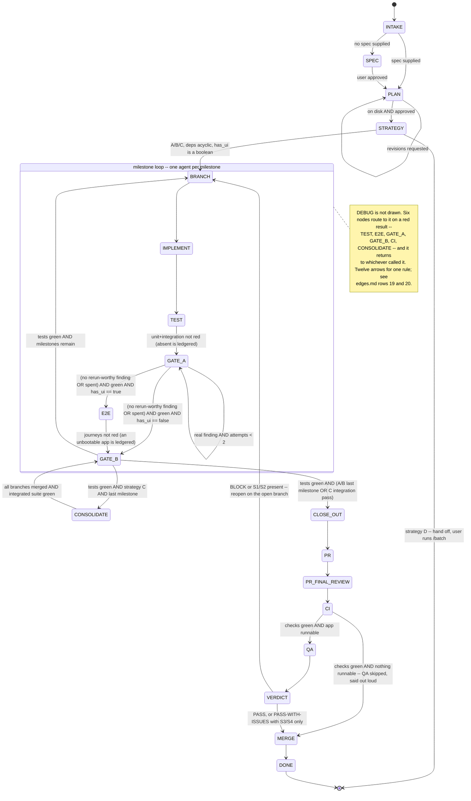

# Node Catalog

The 20 nodes of the SDLC graph. Every node declares the same contract, which is what makes the
graph mechanical rather than narrative.

Companion files: **`edges.md`** (transitions, guards, loop bounds) · **`state.md`** (run-state
schema, resume rules).

---

## The contract

| Field | Meaning |
|---|---|
| **owner** | Who executes it — a `*-node.md` reference file, a live skill dispatch by name, a workflow script, **a milestone agent** running the whole milestone loop on the orchestrator's behalf, or `inline` (the orchestrator itself). |
| **inputs** | What it reads from state. A node may not read anything not listed here. |
| **action** | What it does. |
| **emits** | What it writes back to state. Anything not listed is not written. |
| **exits** | **The complete set of results this node can produce, and where each goes.** Written `result → NODE (edge N)`. **The guard text lives in `edges.md` and only there** — this row names the destination, never the condition. Enumerating exits is what makes totality *checkable* instead of hoped-for, borrowed from LangGraph's `Command[Literal["a","b"]]`; **four of this project's defects were a result the guard set did not cover.** |
| **on failure** | Where control goes when the action fails rather than returning a verdict. Any path to `BLOCKED` also writes `stopped = { kind: "blocked", at_node, at_milestone, guards_tested[], tried[] }` — that object is what makes the pause resumable. `guards_tested[]` is a list: a zero-match halt has no single failing guard, it has a set that all failed. |
| **max attempts** | Re-entry bound, counted in `attempts["<NODE>:<milestone-id>"]` — or bare `attempts.QA` for the run-level `VERDICT` bound. **For the six nodes that route to `DEBUG`, this number is also the `DEBUG` round-trip's bound** (`edges.md` § Loop bounds). On exhaustion the run goes `BLOCKED` **unless stated otherwise** — `GATE_A` is the one node that proceeds instead. |
| **requires** | External tool that must resolve at preflight. **Absent → `skipped_gates[]` entry; the node may never be recorded as passed.** On an agent-owned node the preflight happens **inside the milestone agent** and is **asserted** in the bundle, because "the orchestrator did not see it" and "it did not happen" have to be treated the same way. |
| **human** | `none` (default) · `approval-after` · `choice-after` · `confirm-before` · `await-external` · `escalation`. One boolean could not carry these — which is why `MERGE` and `VERDICT` never got an `interactive` row. |

> **`exits` used to be two rows.** Every contract carried an `exits` row (*result → edge number*) and
> an `exit guards` row (*condition → node*) — the same information keyed two ways, 40 rows across the
> file, worded differently from `edges.md` on purpose *"for the implementer working inside one
> contract"*. That difference then needed a spec check to stop the two renderings drifting, and
> `history[].guard` had to declare which one it quoted. **One rendering of a guard, in the file that
> owns guards.**

### Human stops — typed, not boolean

Borrowed from LangGraph's `interrupt_before` / `interrupt_after`, which are static, per-node and
**directional**. A single `interactive: yes` cannot express the difference, and the proof is that
`MERGE` and `VERDICT` were never given one.

| `human` | Meaning | On resume |
|---|---|---|
| `none` | Runs to completion without asking. **The default, and the answer for 14 of 20 nodes.** | Re-run the node |
| `approval-after` | Produce the artifact, then ask "is this right?" — `SPEC`, `PLAN` | **Re-ask.** The artifact exists; the approval does not until given |
| `choice-after` | Present options, then ask which — `STRATEGY` | Re-ask, unless the choice is already in `context` |
| `confirm-before` | Ask **before** acting, because the act is hard to reverse — `PR` when `auto_open_mr == false` | **Check the world first.** See the re-execution hazard below |
| `await-external` | Not a question. Block on something the world must do — `MERGE` | **Re-poll, never re-ask.** A human may have already acted |
| `escalation` | Only on an exhausted bound — `VERDICT` on the 2nd reopen | Re-ask |

**These six rows are the whole list of human stops.** `SKILL.md` describes what each one needs from
the user and points here for which nodes carry them; it does not keep a second table. It did, for two
releases — an eight-row table under a heading that said six, because two `STRATEGY` sub-questions had
been added as rows.

> **The re-execution hazard — LangGraph documents this and we did not.** In LangGraph, resuming an
> interrupt **re-executes the node from the start**, so anything before the pause runs *twice*. The
> same applies here, and `confirm-before` is where it bites: a `PR` node that opens the pull request
> and *then* pauses would, on resume, **open a second one.**
>
> The rule: **a `confirm-before` node asks first and acts once.** And on resume, *derive what already
> happened from the world* — `gh pr list --head <branch>` before opening, `git branch --merged` before
> merging — never from what the state file says you were about to do.

**Live dispatch vs. node file.** A node owned by a `*-node.md` file runs a copied, graph-scoped
procedure. A node owned by *live dispatch* invokes an installed skill by name — used for coding
standards and external tools, which must never be stale copies.

### The milestone agent — one subagent per milestone

**Seven nodes are executed by a milestone agent, not by the orchestrator:** `BRANCH`, `IMPLEMENT`,
`TEST`, `GATE_A`, `E2E`, `GATE_B` and the `DEBUG` round-trips they call. One agent per milestone under
A and B; under C one per worktree, N spawned at once — which is the only reason C exists.

This is a change of `owner` and **nothing else**. No node was added, no edge retired, no guard
reworded. The full contract, the brief, the `MILESTONE_BUNDLE` schema and the return gate live in
**`workflow-dispatch.md`**; what matters when reading a contract below is:

| | |
|---|---|
| **The agent executes** | It runs the node body, exactly as written here, and reports what happened. |
| **The orchestrator decides** | It evaluates every guard, in `edges.md` order, on the facts returned. **The agent evaluates none.** |
| **The orchestrator records** | Every `emits` row below is still written by the orchestrator, on return, after the return gate passes. An agent never writes the state file. |
| **Two authors** | The agent writes each transition's `observation` — it was there. The orchestrator writes `verified` — what it checked afterwards. Neither writes the other's. |
| **Nothing is recorded on an agent's word** | The return gate stands between a bundle and `history[]`. An unproven gate is re-run, not written. |

**Why the orchestrator does not simply run them.** Full test output, whole diffs, review findings and
CI logs are what actually consume a context window, and they all arrive at these seven nodes. The
orchestrator that has to hold the *whole run* cannot also be the one reading them.

---

## Graph

> **The two `GATE_A` exits route on `rerun_recommended`, never on `clean`.** `clean` also goes false
> when a reviewer was merely *absent*, so routing on it matches **zero guards** and halts the run —
> `edges.md` records that happening twice. **Route on test state; report on `clean`.**
>
> **And they test `has_ui == true` / `== false`, never `has_ui` / `NOT has_ui`.** The field is
> tri-state, but by the time this node runs it cannot be `null`: **edge 6 refuses to leave `STRATEGY`
> until it is a real boolean.** That is a change from the previous shape, where the tri-state was
> allowed into the loop and caught 200 lines later by a dedicated halt edge — see `edges.md` edge 6.

**One tail, three loops.** From `CLOSE_OUT` onward every strategy runs the same sequence. Only the
loop differs: A and B build every milestone on one branch; **C builds each in its own worktree,
concurrently where `deps` allow, and `CONSOLIDATE` merges them back into a single integration branch
before the shared tail begins.**

---

## Setup nodes

### `INTAKE`

| | |
|---|---|
| **owner** | inline |
| **inputs** | user request; repo working tree |
| **action** | Classify the request. Detect stack from `package.json` and workspace layout, `has_ui` from UI framework presence, `main_branch` from the repo default, **`unborn_main` from whether that branch has any commits** (`git rev-parse --verify <main_branch>` failing means unborn — normal for a fresh `git init`), and `host` from the `origin` remote — **`none` when there is no remote.** Then, **in this order**: append `docs/graph-runs/` to the project's `.gitignore` (create it if absent; no-op if already present), mint `run_id` as `<subject>-<DD>-<MM>-<YYYY>` with **`<subject>` at most five words from the opening request**, and create `docs/graph-runs/<run-id>/state.json`. **Then invoke `/sdlc-graph:onboarding`** and relay its checklist — advisory, on every run, and neither waited on nor recorded. |
| **emits** | `run_id`, `schema_version`, `trace` (from `--trace`; **`false` when absent**), `context.{stack,has_ui,main_branch,unborn_main,host}`, `context.qa_env` (where discoverable), `spec_path` (if supplied), `status: RUNNING` |
| **exits** | `no spec` → `SPEC` (1) · `spec supplied` → `PLAN` (2) · *not a git repo* → on failure |
| **on failure** | **not a git repo → `BLOCKED`.** An undetectable stack is **NOT** a failure — see below. |
| **max attempts** | 1 |
| **requires** | `git` |

> **Greenfield is normal, not a failure.** An empty or near-empty repo has no detectable stack, and
> the stack is properly *decided* at `SPEC` anyway. Set `stack: "unknown"` and `has_ui: null`, say so
> in the intake summary, and continue. **Only a missing git repo blocks.** Halting at node one for
> every new project would make the graph unusable exactly where a plan helps most.
>
> `has_ui` decides whether the `E2E` node exists for the whole run, so **state it explicitly in the
> intake summary**. If it is still `null` by `STRATEGY`, that node resolves it and edge 6 will not
> fire until it has.

> **`/sdlc-graph:onboarding` is invoked here, on every run.** Preflight resolves each node's
> `requires` as that node comes up, which tells you a tool was missing *after* the gate it would
> have run in. The checklist answers the same question for the whole roster before the run starts —
> every tool on it third-party and optional, none of it a dependency of this graph. Relay it and
> keep going.
>
> **The check is automatic; installing never is.** The checklist is read-only: it installs nothing,
> downloads nothing, enables nothing and changes no configuration. When a row comes back missing it
> says so, prints the install line, says what the run loses without it, and **hands the decision
> back to the human** — who may run it now, later, or never. Neither this node nor any other may
> install a tool, offer to install one, or treat a missing row as licence to "just set it up".
> A run proceeds identically either way, and the absence is recorded where absences are recorded.
>
> **It is advisory, and every word of that is load-bearing.** It emits nothing, so nothing in this
> contract's `emits` row comes from it. `INTAKE` does not wait on its result, does not route on it,
> and records nothing from it: a missing tool is still recorded exactly as it always was — at the
> node that needed it, by preflight, in `skipped_gates[]`. A run whose checklist is entirely red is
> not degraded by the checklist; it is a run that will ledger more.
>
> **It does not stop, block, delay or halt a run, and it is not a human stop.** There are six and
> this is not one of them. It asks nothing and waits for no answer; if it fails, is unavailable, or
> returns nothing, **say so in one line and continue to the exit guard in the same turn** — an
> advisory that can fail a run is not an advisory. *"Runs every time"* never means *"may stop the
> run"*.
>
> **It is cheap on purpose** — one shell call, no network, no per-tool probing — because it is paid
> on every run. Its roster lives in `docs/DEPENDENCIES.md`, which is the only list of these tools
> in the plugin.

### `SPEC`

| | |
|---|---|
| **owner** | `brainstorming-node.md` |
| **inputs** | user request, `context` |
| **action** | Socratic one-question-at-a-time design dialogue; write the spec to a Markdown file and revise it in place until approved. **Write it, do not commit it** — `SPEC` runs before `BRANCH`, so there is no feature branch yet and committing here could land on a protected branch. The spec is committed on the first branch `BRANCH` creates. |
| **emits** | `spec_path` |
| **exits** | `approved (file on disk)` → `PLAN` (3). Revision requests stay **inside** the node — the conversation is the loop, not an edge. |
| **on failure** | user abandons → `BLOCKED` |
| **max attempts** | unbounded (user-driven dialogue) |
| **requires** | — |
| **human** | **`approval-after`** — write the spec, then ask. Unbounded: this is a conversation, not a retry. |

### `PLAN`

| | |
|---|---|
| **owner** | `plan-guidelines-node.md` (Phase 1) |
| **inputs** | `spec_path`, `context` |
| **action** | **Enter plan mode**, then structure the work into milestones and steps, then hand the approved plan off to `docs/<subject>/<name>-<DD>-<MM>-<YYYY>-plan.md`. Four phases — see *The plan-mode path* below. Revisions rewrite in place until the user accepts. |
| **emits** | `plan_path`, `milestones[]` — each with `id`, `name`, `steps`, **`deps` (always present, `[]` when there are none)**, **`is_fix: false`** and **`touches_ui`** (all three seeded on every milestone so `BRANCH`, `GATE_B`, `E2E` and `STRATEGY` never read an absent field) · **on a greenfield run, `context.stack` resolved from the approved design** |
| **exits** | `revisions requested` → `PLAN` (4) · `approved, on disk` → `STRATEGY` (5) · *cannot decompose* → on failure |
| **on failure** | cannot decompose → `BLOCKED` naming what could not be split · **plan mode declined → fall back to writing the plan directly and asking in prose, and append a `skipped_gates[]` entry: the edit lock did not apply** |
| **max attempts** | revision is unbounded — it is user-driven, like `SPEC` |
| **requires** | — |
| **human** | **`approval-after`** — the plan decides everything that gets built. Unbounded, same reason as `SPEC`. |

> **Cardinal rule, inherited:** the plan file exists on disk before any implementation node runs.
> `STRATEGY` will not accept a plan held only in conversation.

### The plan-mode path

| Phase | | Enforced by |
|---|---|---|
| 1 | `EnterPlanMode` — **the edit lock comes on** | **harness** |
| 2 | Explore, decide the milestones, write to the harness's plan file | model |
| 3 | `ExitPlanMode` — presents the plan and waits for approval | **harness** |
| 4 | On approval, **copy** to `docs/<subject>/<name>-<DD>-<MM>-<YYYY>-plan.md`, set `plan_path` | model |

> **The edit lock is the whole reason.** Everything else here — the approval, the file, the milestone
> structure — the graph already provides. What it structurally **cannot** provide is a mechanism that
> *prevents* implementation during `PLAN`. Rule 1 and this contract are instructions; the model can
> disregard them, and if it does it writes onto whatever branch is checked out — **possibly the
> protected one, because `BRANCH` has not run yet.** In plan mode the tool layer refuses.

> **Phase 4 is a hand-off, not a twin.** Afterwards `docs/plans/…` is the single authoritative plan
> and nothing syncs back. Two plan files is the exact drift this graph exists to prevent.

> **Resume is slightly worse here, deliberately.** Harness mode is not expressible in the state file,
> so a run resumed at `PLAN` re-enters plan mode and asks consent again. Annoying, not dangerous —
> and worth the edit lock.

> **Why this gate exists.** `PLAN` is the **last cheap moment to change direction.** Once `STRATEGY`
> commits to a branching shape and the loop starts, a correction costs branches, PRs and CI runs. A
> plan that was merely *seen* while answering a different question is not an approved plan.

### `STRATEGY`

| | |
|---|---|
| **owner** | `plan-guidelines-node.md` (Phase 1, branching) |
| **inputs** | `plan_path`, `milestones[]`, `context` |
| **action** | Present the milestone list and its dependency graph; ask the user to choose branching **A** / **B** / **C** / **D**, `auto_open_mr`, `run_mode`, and the standards handshake where the stack needs one. **Resolve `context.has_ui` if it is still `null`** — the loop must not see the third value. Validate the dependency graph is acyclic. **Seed the task list** — one task per milestone. |
| **emits** | `context.branching`, `context.auto_open_mr`, `context.run_mode`, `context.standards_handshake` (frontend/both only), **`context.has_ui` when it was `null`**, **`cursor`** (the first milestone with no unmet `deps` — the loop cannot start without it), task list seeded |
| **exits** | `A/B/C, deps acyclic, has_ui boolean` → `BRANCH` (6) · `branching == D` → `HANDOFF` (7) · *cyclic deps* → on failure |
| **on failure** | cyclic dependencies → `BLOCKED` naming the cycle · **any settled field still `null` after the conversation → `BLOCKED`** naming the field |
| **max attempts** | 1 |
| **requires** | — |
| **human** | **`choice-after`** — present the milestones and their dependency graph, then ask. Never inferred. |

#### The settlement check — mandatory, mechanical, before edge 6 fires

This node exists so the loop never stops to *decide* something. That only holds if every field it
settles is actually **on disk** when it exits — an answer that was given in conversation and never
written is exactly the state a resumed run cannot recover, and it re-opens the interruption this node
was built to close. So do not eyeball it. **Read the state file back and confirm all seven:**

| Field | Legal at exit | Not legal |
|---|---|---|
| `context.branching` | `A` · `B` · `C` · `D` | `null`, or a value the user did not say |
| `context.auto_open_mr` | `true` · `false` | `null` — `PR` would then have to ask mid-loop |
| `context.run_mode` | `continuous` · `checkpoint` · `on-exception` | `null` — the stop set would be undefined |
| `context.has_ui` | `true` · `false` | **`null`** — edge 6 refuses it, and a tri-state reaching `GATE_A` erases `E2E` for the whole run with no ledger entry |
| `context.standards_handshake` | an object when `stack ∈ {frontend, both}`; `null` for backend | absent on a frontend stack — `IMPLEMENT` would stop for another skill's approval gate |
| `cursor` | the first milestone with no unmet `deps` | `null` — the loop cannot start |
| `milestones[].deps` | an array on **every** milestone, acyclic, every id real | absent, dangling, or cyclic |

**A `null` in the first column is `BLOCKED`, naming the field — not a default quietly chosen for the
user.** Every one of these is a decision the graph declared it would not infer, and inferring it *after*
asking is the same defect as inferring it instead of asking.

> **This node settles everything the loop must not stop to decide.** Four settings and one
> resolution, all in one conversation, so the loop is never interrupted to *choose* something:
>
> | Settled here | Because otherwise |
> |---|---|
> | `branching` | — the loop's shape |
> | `auto_open_mr` | `plan-guidelines` says *ask before creating the MR*; `pr-mr-prepare` says *open it automatically, don't pause*. Two source skills, one conflict, settled once |
> | `run_mode` | `continuous` (the six stops only) · `checkpoint` (**plus a stop after every milestone's `GATE_B`**) · `on-exception` (plus a stop whenever a gate is skipped, a bound is exhausted, or a bundle was rejected). **Declared stops, not invented ones** |
> | `standards_handshake` | a coding-standards skill may run its own handshake, ending in *"NEVER start the actual task work until the user has approved"* — a fifth interactive gate injected inside a node the graph declares non-interactive. The graph does not get to ignore another skill's approval rule; it gets to satisfy it early |
> | **`has_ui`, when `null`** | the tri-state would reach `GATE_A`, where `NOT null` is true and the run would **erase `E2E` structurally with no ledger entry**. Resolving it here costs one question; routing around it cost an edge, an itinerary and four surfaces |

> **`checkpoint` used to say "after every `MERGE`", and that stopped being a checkpoint.** It was
> written when strategy C merged one PR per milestone. The shared tail collapsed that to **one merge
> per run**, leaving `checkpoint` promising a look at each milestone and delivering a single stop
> immediately before `DONE` — after every decision it could have influenced. `GATE_B` is where a
> milestone now finishes. **A cadence option that survives a topology change unexamined stops meaning
> what it says.**

---

## Milestone-loop nodes

### `BRANCH`

| | |
|---|---|
| **owner** | **milestone agent** → `plan-guidelines-node.md` § `BRANCH`. The orchestrator reserves the branch name and records `base_sha` before the spawn; the agent creates the branch (and, under C, the worktree) and reports what it made. |
| **inputs** | `cursor`, `context.{branching,main_branch}`, `milestones[]` |
| **action** | Resolve the parent branch — `main_branch` for an independent milestone, **the parent milestone's branch** for a dependent one — and create `<task-id>/<short-description>`. **Under C, also create a worktree for it** (`git worktree add`), so independent milestones can be built concurrently without colliding over one index. **Idempotent under A and B** — under **A**, create the run branch on first entry and no-op on every later milestone; under **B**, no-op throughout, staying on the current branch (never a protected one). |
| **emits** | `milestones[cursor].branch`, `milestones[cursor].worktree` (C only) |
| **exits** | `branch checked out` → `IMPLEMENT` (8) · *protected branch / dirty tree* → on failure |
| **on failure** | protected branch, or dirty tree → `BLOCKED` |
| **max attempts** | 1 |
| **requires** | `git` — plus worktree support under C |

> **A reopened fix milestone never gets a new branch or a worktree, under any strategy.** By the time
> `VERDICT` reopens, there is exactly one open unmerged branch carrying everything — the run branch
> under A/B, `integration.branch` under C — and it has a PR open against it. The fix commits there.
> One scoped change gains nothing from isolation, and a separate branch would need a second
> consolidation and a second PR to land.

### `IMPLEMENT`

| | |
|---|---|
| **owner** | **milestone agent** → **live dispatch** of the project's own installed coding-standards skill for `context.stack` — the backend one, the frontend one, or both when `stack == both`. The agent dispatches it itself, so it is still the *installed* version and never a copy. **The graph names no standards skill and bundles none**; what gets dispatched is whatever the project has. |
| **inputs** | `cursor`, `milestones[cursor].steps`, `context.stack`, `context.standards_handshake` |
| **action** | Implement every step **this node owns** (see below) on the milestone's branch, committing as it goes. **The final commit and the `IMPLEMENT → TEST` state write are one act, in one turn** — see *The commit-and-record rule*. No scout pass, no forced standards reload. |
| **emits** | the `IMPLEMENT → TEST` transition, as part of the same node rather than a later decision |
| **exits** | `TEST` (9 — the steps **this** node owns; the test steps are owed at 10) · *a step is not implementable as planned* → on failure |
| **on failure** | a step is not implementable as planned → `BLOCKED`, surfacing the plan defect |
| **max attempts** | 1 |
| **requires** | the standards skill for the detected stack — **absent → `skipped_gates[]`**, implement without it and say so |
| **human** | `none` — **and this is the node that most often gets it wrong** |

> **Do not stop here. Observed failing in THREE real runs.** Each halted at `IMPLEMENT` with
> `status: RUNNING` and `stopped: null` — nothing failed, no bound was hit, the graph simply stopped
> where it had no license to. `IMPLEMENT` is the longest and most open-ended node, so finishing a
> chunk of real work *feels* like a reporting point. It is not one.
>
> **When the last step is committed, continue straight to `TEST` in the same turn.** If the user
> genuinely wants a look after each milestone, that is `run_mode: "checkpoint"` — settled at
> `STRATEGY`, not improvised here.

> **No scouting pass, and no forced standards reload.** `PLAN` already produced this milestone's
> steps; a scout pass per milestone buys information the plan should already carry. A plan too thin to
> implement from is a `PLAN` defect to fix at `PLAN`, not a gap to paper over on every pass.

### Which steps `IMPLEMENT` owns

`milestones[].steps` carries **two kinds of step, by design**: `PLAN` is required to bake test steps
into every milestone, and `TEST` is the node that writes them. So `IMPLEMENT` does not owe all of
them, and the split is mechanical rather than a judgement made under time pressure:

| The step is | when its deliverable is | committed by | owed at guard |
|---|---|---|---|
| **`TEST`'s** | a **test** — a path matching `*.test.*` / `*.spec.*`, or one under `test/`, `tests/`, `__tests__/`, `e2e/`; or a step that says to write or update tests | `TEST` | 10 |
| **`IMPLEMENT`'s** | anything else | `IMPLEMENT` | 9 |

**Partition, not a discount.** Every step lands in exactly one row, and each row is owed at exactly
one guard, so no step falls into the gap: a test step left uncommitted fails guard 10 just as an
implementation step left uncommitted fails guard 9.

`steps_committed` on the bundle's `IMPLEMENT` row counts **this node's partition only**. It once
counted all of them, which made a healthy milestone — implementation committed here, its test file
committed at `TEST`, exactly as `testing-standards-node.md` prescribes — read as a guard that could
not be satisfied at a node with no second exit. **A guard no correct run can satisfy is not strict;
it is broken**, and it teaches the next agent that `BLOCKED` is a normal way to finish a milestone.

### The commit-and-record rule

Three occurrences say the warning above is not enough, so this node carries a **mechanical
invariant** instead of a fourth reminder.

**The root cause was that executing a node and recording the transition are two separate acts by the
same agent**, so the second can simply be forgotten — and nothing notices, because a forgotten write
looks exactly like a node still running. **Delegation moved the two acts into two different agents,
and the old check broke in both directions**, so the invariant is re-derived rather than copied:

> **INVARIANT — `commit ⇒ bundle ⇒ record`. Every commit on a milestone agent's branch appears in
> exactly one of: the bundle's `evidence.commits[]` — and so in `history[].evidence` once it is
> replayed — or the orchestrator's `stopped` record for that milestone. A commit that no `history[]`
> entry accounts for is the halt.**
>
> **Agent side:** its final act is to return the bundle. **Orchestrator side:** the milestone's id
> enters `in_flight` before the spawn and leaves only on a completed replay or on writing `stopped`;
> an id with neither is the halt signature.

Checkable by anyone with three commands and no judgement — see `state.md` § *Write points*.

Two habits make the invariant hold, both of which a real run violated before halting:

- **Never batch transitions.** Writing `IMPLEMENT → TEST` and `TEST → GATE_A` in one edit after the
  fact means `node` never held `TEST`. In the run that halted, this batching began **102 minutes
  before** the visible halt and was its precursor.
- **Never report progress from inside a node.** A status summary is not a stopping point; if it is
  worth saying, say it *after* the transition is written and the next node has started.

### `TEST`

| | |
|---|---|
| **owner** | **milestone agent** → `testing-standards-node.md` § `TEST` |
| **inputs** | `cursor`, `context.stack` |
| **action** | Write and run the milestone's unit tests alongside each component and its integration tests per endpoint — **including every step `IMPLEMENT` left to this node** (§ *Which steps `IMPLEMENT` owns*), committed here. Run the project's unit + integration suites. |
| **emits** | `attempts["TEST:<id>"]`, `debug_return_to = TEST` on failure |
| **exits** | `this node's steps committed` **and** `both suites not red` (green, or absent + ledgered) → `GATE_A` (10) · `red` → `DEBUG` (19) · *red at the 3rd attempt* → `BLOCKED` (bound) |
| **on failure** | red suite → `DEBUG` |
| **max attempts** | **3**, then `BLOCKED` |
| **requires** | project test scripts — **absent → `skipped_gates[]`**, never recorded as passed |

### `GATE_A`

| | |
|---|---|
| **owner** | **milestone agent** → `code-quality-pipeline-node.md` § `GATE_A` → `workflows/gate-a.workflow.js`. The agent **attempts** the workflow and returns its whole result object in `evidence.gate_a`, including the `runId`. **The `Workflow` tool is absent in a subagent session** — observed on every real run — so it then **mimics the script**: same directory grouping, same four steps in order, groups concurrent (`dispatch: "mimic"`, `run_id: null`, **real** `groups_*`). `dispatch: "direct"` is the last resort for when it cannot group at all and reports `groups_*: null`. All three are legal; none is a skip. |
| **inputs** | `cursor`, changed files vs. the milestone's branch point, `context.has_ui` (a boolean by edge 6) |
| **action** | Per changed file, in strict order: **Code Review → Simplification → Security Review → Final Review**, applying each step's findings before the next. Files run **concurrently**; the four steps are sequential *within* a file. **Then re-verify unit + integration** — steps 2 and 3 changed code that was green on entry. |
| **emits** | `attempts["GATE_A:<id>"]` (findings re-run) or **`attempts["GATE_A-dispatch:<id>"]`** (workflow error — never the same counter), `milestones[cursor].gate_a_run_id`, `debug_return_to = GATE_A` on a red suite, `skipped_gates[]` for any absent reviewer |
| **exits** | `rerun-worthy finding, attempts < 2` → `GATE_A` (11) · `suite red after the gate's own edits` → `DEBUG` (19) · `tests green, budget clear or spent, has_ui true` → `E2E` (12) · `same, has_ui false` → `GATE_B` (13). **A skipped reviewer step is not an exit** — it is a ledger entry inside the 12/13 results. |
| **on failure** | unit/integration red after the gate's own edits → `DEBUG` (2 attempts) · **workflow error → retry once counting `attempts["GATE_A-dispatch:<id>"]`, then `BLOCKED`.** A dispatch that returned no result and ran zero agents is not a review attempt and must not spend the findings budget. **A session with no `Workflow` tool is not a workflow error**: the agent mimics the script, reports `dispatch: "mimic"` (or `"direct"` if it could not group at all), and **nothing is charged** |
| **max attempts** | **2** on `GATE_A:<id>` — one re-run, and **only** for a genuine bug/security/regression finding. Separately **1** on `GATE_A-dispatch:<id>` for a workflow that failed to run at all. |
| **requires** | `pr-review-toolkit:code-reviewer` (steps 1 & 4 — it must be **write-capable**, since those steps apply fixes; `feature-dev:code-reviewer` has no Edit/Write tool) · `code-simplifier` (step 2) · `security-review` (step 3) — **each absent → its own `skipped_gates[]` entry, and the run CONTINUES**. **Preflight tests invocability, not installed-ness** — a tool that is installed but cannot run here is just as absent. |

> **A missing reviewer never halts the run.** It appends a `skipped_gates[]` entry, the gate may not be
> recorded as passed, and the run **proceeds** — that is the ledger's whole purpose. Guards 12/13 test
> `rerun_recommended`, not the script's `clean` field, precisely so an absent tool cannot deadlock the
> node.

> **Exhaustion here does not block.** `GATE_A` is the one bounded cycle whose exhaustion is *proceed*,
> not `BLOCKED`: after the single re-run, remaining findings are documented and the run moves on,
> where the holistic gate gets its own look. That is why guards 12 and 13 read `no rerun-worthy
> finding OR re-run budget spent` — without the second clause a genuine finding at `attempts == 2`
> would match no guard at all and halt the graph.

### `E2E`

| | |
|---|---|
| **owner** | **milestone agent** → `testing-standards-node.md` § `E2E` |
| **inputs** | `cursor`, `context.has_ui`, **`milestones[cursor].touches_ui`** |
| **action** | Run the app's Playwright suite. **When `touches_ui` is true, author Playwright specs for the components this milestone added — always, before the suite runs.** Journeys stay a handful for the whole app; the per-milestone component specs are a separate, growing set. On a milestone that touches no UI, this node is a **regression re-run** of the existing set, which is its own value. **Every spec drives the real stack — front and back both running locally, no network mocking**; a disposable or seeded database is the one permitted substitution. |
| **emits** | `attempts["E2E:<id>"]`, `debug_return_to = E2E` on failure, `skipped_gates[]` when a `touches_ui` milestone ships without its component specs |
| **exits** | `journeys not red` (green, or the app unbootable + ledgered) → `GATE_B` (14) · `red` → `DEBUG` (19) · *red at the 3rd attempt* → `BLOCKED` (bound) |
| **on failure** | red → `DEBUG` |
| **max attempts** | 3 |
| **requires** | **a locally runnable app and API** — genuinely unbootable while `has_ui == true` → `skipped_gates[]`, and the run may not be recorded as e2e-covered. **Playwright is deliberately NOT listed here** — see below. |

> **This node does not exist when `has_ui == false`.** For a backend-only service the edge is absent
> — `GATE_A` goes straight to `GATE_B`. This is a structural guard, not a skipped step, and it is
> never recorded in `skipped_gates[]`.
>
> **Do not confuse that with an app that will not boot.** `has_ui == true` with an app that genuinely
> cannot be brought up means the node exists and could not run — **that is a skipped gate.**

> **Playwright uninstalled is NOT a skipped gate — install it.** `requires` is for capabilities the run
> cannot obtain; Playwright is two commands. **Observed in a real run:** a `has_ui == true` project
> ledgered `E2E` at milestone 1 for *"Playwright is not installed and there is no runnable front-end
> yet"* — both halves true, conclusion wrong. The front-ends were nine milestones away, so that entry
> would have repeated on every milestone until then. **And the ledger is append-only, so a premature
> entry cannot be tidied away.** Install it at the first `E2E` entry of the run. See
> `testing-standards-node.md` § *Playwright is a dependency, not a capability*.

> **A milestone that builds UI gets Playwright specs for what it built. No exception, no judgement
> call.** `touches_ui == true` and no new spec authored is a `skipped_gates[]` entry and the node is
> **not** recorded as passed — identical treatment to an app that cannot be brought up, because the
> outcome is identical: the components this milestone shipped were never driven. The old wording made
> authoring a judgement call, and the judgement came out "not this one" every time.
>
> **No mocks. The real stack, locally.** A mocked API turns an e2e test into an expensive unit test of
> the component's rendering, and it passes for exactly the wiring bugs this level exists to catch.
> **The database is the one permitted substitution.**

> **`touches_ui` is per-milestone; `has_ui` is per-run. Both must be true for the mandate to fire.**
> `has_ui` decides whether this node exists at all; `touches_ui` decides whether this pass must
> *write* specs or merely re-run them. `PLAN` seeds it on every milestone exactly as it seeds
> `is_fix`, so the field is never absent.

### `GATE_B`

| | |
|---|---|
| **owner** | **milestone agent** → `code-quality-pipeline-node.md` § `GATE_B`. **The agent's last transition is *into* `GATE_B`** — its exits read run-level state the agent is not given, so 15 / 16 / 17 are the orchestrator's. |
| **inputs** | the whole diff of the branch under review vs. `main_branch` — the milestone branch on a per-milestone pass, `integration.branch` on C's integration pass. **When `context.unborn_main` is true, the diff base is the empty tree** |
| **action** | Holistic review of the **entire change set at once** — cross-file interactions and overall coherence, which the per-file Gate A structurally cannot see. Fix every finding, then re-run unit + integration. |
| **emits** | `attempts["GATE_B:<id>"]` — or **`attempts["GATE_B:integration"]`** on C's integration pass — `debug_return_to = GATE_B` on failure, `skipped_gates[]` if the reviewer is absent |
| **exits** | `tests green, a milestone remains, integration.branch null` → `BRANCH` (15) · `tests green, C, last milestone, integration.branch null` → `CONSOLIDATE` (16) · `tests green, A/B last milestone or C integration pass` → `CLOSE_OUT` (17) · `tests red after review fixes` → `DEBUG` (19) · *red at the 2nd attempt* → `BLOCKED` (bound) |
| **on failure** | tests red after fixes → `DEBUG` |
| **max attempts** | 2 |
| **requires** | the **built-in `code-review`** skill, invoked with an explicit range: `code-review <main_branch>..<branch> high`. It reads a **local diff**, needs **no open PR**, and `--comment` must **not** be passed here. **absent → `skipped_gates[]`**, and preflight must test **invocability**, not installed-ness. |

> **This node is NOT `code-review:code-review`.** That plugin command's `allowed-tools` are `gh pr` /
> `gh issue` only — it cannot read a local diff, so it can never back this node, which always runs
> **before** `PR`. A run that reports the reviewer `uninvocable` "because no PR exists" invoked the
> wrong tool: this node's reviewer takes a branch range and does not care whether a PR exists.
> `code-review:code-review` has its own node, `PR_FINAL_REVIEW`, after the PR is open.
>
> *Observed across four milestones of a real run: four `skipped_gates[]` entries, one per milestone,
> all for a tool that could not have run at this point in the graph under any strategy.*

> Passing Gate A never exempts a change from Gate B. They catch different defect classes: file-local
> vs. cross-file. **Under C this node runs twice, and the second pass is not a repeat** — the
> integration pass sees the whole merged diff against `main_branch`, the cross-*milestone*
> interactions no single worktree could contain.

### `DEBUG`

| | |
|---|---|
| **owner** | **milestone agent** → `systematic-debugging-node.md` § `DEBUG` — except when `debug_return_to` is `CI` or `CONSOLIDATE`, which are the orchestrator's round-trips because those callers are. |
| **inputs** | the failure (logs, failing command, diff), `debug_return_to` |
| **action** | Root-cause the failure before proposing any fix. Apply the minimal legitimate fix. |
| **emits** | `attempts["<caller>:<milestone-id>"]` — the **caller's** counter, never its own; clears `debug_return_to` on success |
| **exits** | `root cause fixed` → the node named in `debug_return_to` (20) · *not fixed at the caller's bound* → `BLOCKED` |
| **on failure** | same error after the caller's `max attempts` → `BLOCKED` |
| **max attempts** | inherited from the calling node |
| **requires** | — |

> **Re-entrant from six callers** — `TEST`, `E2E`, `GATE_A`, `GATE_B`, `CI` and `CONSOLIDATE` — and
> always returns to whichever called it. `debug_return_to` is what makes the return deterministic:
> without it the graph could not tell a test failure from a CI failure on resume. It is a **field, not
> a guard** — the guard on edge 20 is `root cause fixed`, because a `DEBUG → TEST` transition cannot
> mean anything else, and restating the destination in the guard is what kept twelve rows in the
> transition table.

> **The caller's bound wins, and it can be tighter than the method wants.** The source
> `systematic-debugging` method escalates to "question the architecture" only after 3 failed fixes, but
> `GATE_B ↔ DEBUG` allows just **2** — so that node blocks before the architectural check ever fires.
> That is deliberate: an unbounded debug loop is the worse failure. When a bound is exhausted, put the
> architectural doubt in `stopped.tried[]` so the human inherits the thought instead of losing it.

### `CONSOLIDATE`

**Strategy C only.** The node that turns N parallel worktrees back into one reviewable branch.

| | |
|---|---|
| **owner** | inline |
| **inputs** | `milestones[]` (every `branch`), `context.main_branch`, `run_id` |
| **action** | Create `<task-id>/integration` off `main_branch`. Merge every milestone branch into it **in dependency order** — a milestone's parents before the milestone. Then **run the full unit + integration suite on the integrated result**, because N independently-green branches are not a green whole. Finally remove every worktree and record the branch. |
| **emits** | `integration.branch`, `integration.merged[]` (milestone ids, in the order merged), worktrees removed |
| **exits** | `every branch merged, integrated suite green` → `GATE_B` (18) · `integrated suite red (semantic conflict)` → `DEBUG` (19) · *textual merge conflict* → on failure |
| **on failure** | **textual merge conflict → `BLOCKED`**, naming the conflicting paths and the two milestones that touched them |
| **max attempts** | **3**, then `BLOCKED` |
| **requires** | `git` with worktree support |

> **A conflict is not a bug — a red suite is.** A **textual** conflict means two milestones edited the
> same lines; git cannot resolve it and neither should the graph guess. A **semantic** conflict — git
> merged cleanly and the suite went red — *is* a defect with a root cause, so it routes to `DEBUG` like
> any other red suite.

> **This is the node that makes C worth having.** Parallel worktrees are the only reason to choose C,
> and the previous shape paid for them with a PR, a CI run and a merge *per milestone*. Consolidating
> locally keeps the parallelism and collapses the tail: **one integration branch, one PR, one QA pass,
> one merge.**

> **Merging in dependency order is not cosmetic.** A dependent milestone was branched off its parent,
> so merging the parent first makes the child a fast-forward. Merging out of order replays the
> parent's commits as conflicts against a base that does not contain them.

> **Three things to check here, because nothing else is left to check them.** Under C the agents ran
> concurrently in their own worktrees and this is the first node that sees all of them at once:
>
> 1. **Consolidation happens before `PR`, always.** A run that opened a PR on a milestone branch under
>    C has skipped this node; the tail acts on `integration.branch` and nothing else.
> 2. **`git worktree list` shows only the primary tree when this node exits** — otherwise a worktree
>    outlived its milestone, and the next `BRANCH` may reuse a path that is still checked out.
> 3. **`integration.merged[]` is in dependency order**, parents first, and its length equals the number
>    of milestone branches. A short list is a branch that was never merged and would reach `QA` as a
>    feature nobody integrated.
>
> If worktree removal fails, record a `skipped_gates[]` entry naming the paths — do not block on
> cleanup.

---

## Tail nodes

### `CLOSE_OUT`

| | |
|---|---|
| **owner** | `plan-guidelines-node.md` (Phase 3) + **live dispatch** → `claude-md-improver` |
| **inputs** | `plan_path`, `milestones[]`, `skipped_gates[]` |
| **action** | Mark every milestone/step `[DONE]`/`[SKIPPED]`/`[DEFERRED]` with reasons in the plan file; record key decisions and verification results **including every `skipped_gates[]` entry**; update the project `CLAUDE.md` with structural changes only (keep it under 100 lines); run the improver on it. **Complete `context.qa_env`** — anything `INTAKE` could not discover is gathered here, so `QA` never depends on conversation. |
| **emits** | `context.qa_env` completed, plan file updated |
| **exits** | `plan updated, qa_env complete` → `PR` (21) — **unconditional; this node has exactly one exit** |
| **on failure** | — |
| **max attempts** | 1 |
| **requires** | `claude-md-management:claude-md-improver` — **absent → `skipped_gates[]`**, do the CLAUDE.md update by hand and say the improver was skipped |

> **This node runs *before* the PR and has exactly one exit.** The work still has to reach
> `main_branch` whether or not it produced anything runnable, so there is no `→ DONE` shortcut. The
> "nothing runnable, skip QA" decision lives at `CI` (edge 24) and **must be stated explicitly**.
>
> The payoff: the plan-file updates and the `CLAUDE.md` changes this node makes land **inside the
> reviewed diff**. Under the earlier ordering they were committed after `MERGE`, past the only review
> gate in the graph. **Under C it runs on `integration.branch`**, so the plan records what the
> *combined* result verified.

### `PR`

| | |
|---|---|
| **owner** | `pr-mr-prepare-node.md` |
| **inputs** | `milestones[cursor].branch` or `integration.branch`, `context.{stack,host,main_branch,auto_open_mr}` |
| **action** | Build → format → lint → test, fixing each failure before the next; commit; push with upstream; open the PR (`gh`) or MR (`glab`) against `main_branch` with a clear title, description, and issue ID. **Idempotent** — see below. **Does not re-run the quality pipeline** — `GATE_A` and `GATE_B` already ran as their own nodes. |
| **emits** | `milestones[cursor].pr` |
| **exits** | `PR/MR open — or found already open and updated` → `PR_FINAL_REVIEW` (22) · `host == none: nothing to open, ledgered` → `PR_FINAL_REVIEW` (22) · *push rejected* → on failure |
| **on failure** | red build/lint → fix in place; push rejected → `BLOCKED` |
| **max attempts** | 2 |
| **requires** | `gh` (GitHub) or `glab` (GitLab) matching `context.host`. **`host: none` → no PR exists to open: record a `skipped_gates[]` entry and pass straight through.** |
| **human** | **`confirm-before`** when `auto_open_mr == false`, else `none`. **Ask first, act once.** |

> **Check for an existing PR on this branch first — always update, never open a second.** This node is
> re-entered on every QA reopen: edge 28 sends the fix milestone back through the loop and edge 21
> returns here with the PR still open. Pushing the fix commits updates it, and `CI` re-watches the new
> head. `gh pr list --head <branch> --state open` before `gh pr create`. This makes the re-execution
> hazard load-bearing rather than theoretical — the same node is genuinely entered more than once in a
> normal run, not only after a crash.

### `PR_FINAL_REVIEW`

The one node where `code-review:code-review` can actually run: a PR now exists for it to read and
comment on.

| | |
|---|---|
| **owner** | **live dispatch** → `code-review:code-review` |
| **inputs** | `milestones[cursor].pr`, the branch under review, `context.host` |
| **action** | Review the **open PR** and post the findings as inline comments on it — `--comment` is the point of this node, not an option. It is decision support for the human who merges, sitting on the artifact they are looking at. **Fixes nothing and blocks nothing**: everything that could block already ran at `GATE_A`, `GATE_B` and `TEST`, and `QA` is still ahead. |
| **emits** | `skipped_gates[]` when the reviewer could not run. **No new state field** — this node reports through the ledger the schema already has, so it costs the run-state nothing. |
| **exits** | `review posted — or ledgered and skipped` → `CI` (30). **One exit, unconditional.** |
| **on failure** | reviewer errors → `skipped_gates[]` entry and pass through. **Never `BLOCKED`** — a review that could not run must not strand a PR that is already open. |
| **max attempts** | 1 |
| **requires** | `code-review:code-review`, **and an open PR**. `host: none` or no PR → `skipped_gates[]` and pass straight through. |

> **Why this is a node and not a step inside `PR`.** `PR` is `confirm-before` when
> `auto_open_mr == false` and is re-entered on every QA reopen; folding a reviewer into it would make
> the human confirmation and the review share one attempt budget, and would re-review on every reopen
> pass. Separating them costs one edge and keeps `PR`'s idempotency about the PR alone.

> **It has exactly one exit on purpose.** This node reports; it does not route. Findings become PR
> comments, and anything genuinely blocking is `QA`'s to catch and `VERDICT`'s to route (edge 28).
> Giving a *third* reviewer the power to reopen the loop would be a fourth opinion on a diff that
> `GATE_A` and `GATE_B` have already gated.

### `CI`

| | |
|---|---|
| **owner** | `watch-ci-node.md` |
| **inputs** | `milestones[cursor].pr`, the branch under review |
| **action** | Poll the run to completion (never a blocking wait); on red, pull failing job logs, reproduce the failing command locally, fix the **cause**, verify locally, push, re-watch. Bounded by a time budget (default 15 min) enforced at cycle boundaries. |
| **emits** | `attempts["CI:<id>"]`, `debug_return_to = CI` on failure |
| **exits** | `checks passing (or host out of scope, ledgered), app runnable` → `QA` (23) · `checks passing, nothing runnable` → `MERGE` (24) — QA skip, **say it out loud** · `required checks red` → `DEBUG` (19) · *budget or 2-same-error exhausted* → `BLOCKED` |
| **on failure** | red → `DEBUG`; budget exhausted or same error twice → `BLOCKED` |
| **max attempts** | watch-ci's own budget + its 2-same-error guard |
| **requires** | `gh` with GitHub Actions. **GitLab CI is out of scope** — on GitLab this node is recorded in `skipped_gates[]` and the run proceeds. |

> **Never fake green.** Skipping tests, `continue-on-error`, `|| true`, lowered thresholds, or
> weakened assertions are forbidden — a green obtained that way is a failure of this node, not a pass.

> **`CI` fixes in-loop; `DEBUG` is the escalation.** The two overlap by design: `CI` owns the
> watch → diagnose → fix → verify → push → re-watch loop within its own budget, because most CI
> failures are shallow and a round-trip through another node would cost more than the fix. It routes to
> `DEBUG` when the in-loop attempt fails or the cause is not obvious. `CI` runs the loop **itself**; it
> does not spawn a nested subagent the way the standalone `watch-ci` skill does, because the graph is
> already the orchestrator.

### `QA`

| | |
|---|---|
| **owner** | `qa-engineer-node.md` |
| **inputs** | `plan_path`, `milestones[]`, changed files, **`context.qa_env`** (run instructions, base URLs, API docs, seed, and **two identities**) |
| **action** | Bring up the full real stack; write the QA plan to `docs/qa/` **before the first probe**; live-probe every green path and attack the break-it set; tick the plan off as it goes; close it with a final report. |
| **emits** | `qa.{verdict,qa_plan_path,bugs}` |
| **exits** | `verdict returned (PASS / PASS-WITH-ISSUES / BLOCK)` → `VERDICT` (25) · *missing `qa_env` field* → on failure |
| **on failure** | **missing a required `qa_env` field → `BLOCKED`** naming the field (does **not** consume `attempts.QA`) · app unreachable *despite* valid inputs → `qa.verdict = BLOCK` |
| **max attempts** | 1 per pass; the reopen bound lives on `VERDICT` |
| **requires** | a runnable app. **Two distinct identities** for authorization probing — absent, BOLA/IDOR coverage is recorded in `risks_and_uncovered` and the run proceeds **degraded**, not blocked |

> **This node always probes an unmerged branch, under every strategy** — the run branch under A/B,
> `integration.branch` under C — with the PR open against it. A `BLOCK` verdict stops it before it
> ever reaches `main_branch`. Under C that is only true because `CONSOLIDATE` merged the worktrees
> locally first.

> **A missing input is not a QA failure.** Three distinct outcomes, deliberately kept apart: a missing
> `qa_env` field is an *intake* gap → `BLOCKED`, resumable the moment the human supplies it, and it
> does **not** spend a reopen. An app that will not run *despite* valid inputs is a real defect →
> `qa.verdict = BLOCK`, which does route through `VERDICT` and does spend a reopen. Missing identities
> is neither: the run proceeds and names the uncovered authorization risk. Collapsing the first into
> the second would burn the 2-reopen budget on a typo.

### `VERDICT`

| | |
|---|---|
| **owner** | inline |
| **inputs** | `qa.{verdict,bugs}`, `attempts.QA` |
| **action** | Route on the QA verdict. On reopen, append a fix milestone scoped to the S1/S2 findings — **`is_fix: true`, `deps: []`** — and point `cursor` at it. It commits on the one open unmerged branch and pushes to the already-open PR. |
| **emits** | `attempts.QA`, a new `is_fix` milestone on reopen, **`cursor`** repointed to it, verdict written into the plan file |
| **exits** | `PASS` → `MERGE` (26) · `PASS-WITH-ISSUES, no S1/S2` → `MERGE` (27) · `BLOCK, or any S1/S2` → `BRANCH` (28) · *2nd reopen already spent* → `BLOCKED` (escalation) |
| **on failure** | — |
| **max attempts** | **2 reopens**, then `BLOCKED` for a human decision |
| **requires** | — |
| **human** | **`escalation`** — silent while reopens remain; asks only once the 2nd is spent. |

> **This node exists because `QA` must not decide its own verdict's consequences.** Hanging 26/27/28
> off `QA` would delete a node and merge the executor with the decider — the exact shape that
> deadlocked `GATE_A` on `clean`. `QA` reports; `VERDICT` decides.

> Every confirmed finding is converted into a committed test at the right level before `DONE`, so the
> live pass's discoveries are held by the suite going forward. Discovery is QA's job; regression is
> the suite's.

> **A global step ceiling, on top of the per-cycle bounds.** LangGraph pairs its per-edge logic with a
> `recursion_limit`. Every cycle here is individually bounded, but nothing stops a run performing 400
> *legal* transitions. **`history.length > 250` ⟹ `BLOCKED`**, with `stopped.tried` naming the
> milestone that consumed the most steps. It is a runaway backstop set far above any real run, not a
> budget.

### `MERGE`

| | |
|---|---|
| **owner** | inline |
| **inputs** | `milestones[]`, `integration.branch`, `context.branching` |
| **action** | **Confirm** the PR/MR has been merged — poll `gh pr view <n> --json state` / `glab mr view` until `MERGED`. Then close every task. |
| **emits** | tasks closed |
| **exits** | `PR confirmed merged` → `DONE` (29) · *PR closed unmerged, or merge conflict* → on failure |
| **on failure** | merge conflict, or PR closed unmerged → `BLOCKED` |
| **max attempts** | 1 |
| **requires** | `gh` (GitHub) or `glab` (GitLab) matching `context.host` |
| **human** | **`await-external`** — not a question: it blocks on something the world must do. On resume, **re-poll, never re-ask** — a human may already have merged it. |

> **This node does not merge — it waits for the merge.** Merging a PR is outward-facing and hard to
> reverse, and review is the point of opening one. The graph never merges its own work unprompted.
>
> **`host: none` — a local-only repo.** There is no remote, so `PR` and `CI` are recorded as skipped
> gates and pass through. `MERGE` still does not merge: it asks you to merge into `main_branch`
> yourself and then confirms with `git branch --merged`. Without a PR there is no review mechanism at
> all, which makes the human step *more* important here, not less.

> **This is the last node before `DONE`, under every strategy, and that is the point.** Everything
> that produces evidence has already run on the branch, so the human approving the merge is looking at
> a diff that carries its own QA verdict, its plan updates, its `CLAUDE.md` changes, and the regression
> tests written for every confirmed finding. **One merge per run.**

### `DONE`

| | |
|---|---|
| **owner** | inline (terminal) |
| **inputs** | `skipped_gates[]`, `milestones[]`, `qa` |
| **action** | Write `status: DONE`, link the QA plan from the plan file, and report: milestones completed, gates skipped and why, follow-ups outstanding. |
| **emits** | `status: DONE` |
| **exits** | — terminal. The run ends here; there is no `DONE → [end]` transition, because `[end]` is not a node. |
| **on failure** | — |
| **max attempts** | — |
| **requires** | — |

> A run that reaches `DONE` with a non-empty `skipped_gates[]` **is not a clean run** — the report
> must lead with what was skipped, never bury it.
